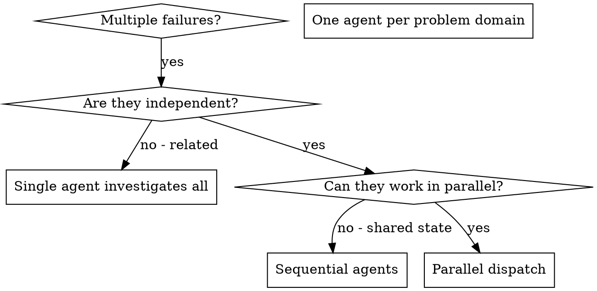

# Dispatching Agenti Paralleli

## Panoramica

Quando hai fallimenti multipli non correlati (diversi file di test, diversi sottosistemi, diversi bug), indagarli sequenzialmente fa perdere tempo. Ogni indagine è indipendente e può avvenire in parallelo.

**Principio base:** Invia (dispatch) un agente per dominio di problema indipendente. Lasciali lavorare in concorrenza.

## Quando Usare



**Usa quando:**

- 3+ file di test falliscono con diverse cause radice
- Sottosistemi multipli rotti indipendentemente
- Ogni problema può essere compreso senza contesto dagli altri
- Nessuno stato condiviso tra le indagini

**Non usare quando:**

- I fallimenti sono correlati (fixarne uno potrebbe fixare gli altri)
- Hai bisogno di comprendere lo stato completo del sistema
- Gli agenti interferirebbero l'uno con l'altro

## Il Pattern

### 1. Identifica Domini Indipendenti

Raggruppa i fallimenti per cosa è rotto:

- Test File A: Flusso approvazione tool
- Test File B: Comportamento completamento batch
- Test File C: Funzionalità abort

Ogni dominio è indipendente - fixare l'approvazione tool non influenza i test di abort.

### 2. Crea Task Agente Focalizzati

Ogni agente ottiene:

- **Scope specifico:** Un file di test o sottosistema
- **Obiettivo chiaro:** Fai passare questi test
- **Vincoli:** Non cambiare altro codice
- **Output atteso:** Riassunto di cosa hai trovato e fixato

### 3. Dispatch in Parallelo

```typescript
// In Claude Code / AI environment
Task("Fix agent-tool-abort.test.ts failures");
Task("Fix batch-completion-behavior.test.ts failures");
Task("Fix tool-approval-race-conditions.test.ts failures");
// Tutti e tre girano in concorrenza
```

### 4. Revisiona e Integra

Quando gli agenti ritornano:

- Leggi ogni riassunto
- Verifica che i fix non confliggano
- Esegui suite di test completa
- Integra tutti i cambiamenti

## Struttura Prompt Agente

I buoni prompt per agenti sono:

1. **Focalizzati** - Un chiaro dominio del problema
2. **Self-contained** - Tutto il contesto necessario per capire il problema
3. **Specifici sull'output** - Cosa dovrebbe ritornare l'agente?

```markdown
Fix the 3 failing tests in src/agents/agent-tool-abort.test.ts:

1. "should abort tool with partial output capture" - expects 'interrupted at' in message
2. "should handle mixed completed and aborted tools" - fast tool aborted instead of completed
3. "should properly track pendingToolCount" - expects 3 results but gets 0

These are timing/race condition issues. Your task:

1. Read the test file and understand what each test verifies
2. Identify root cause - timing issues or actual bugs?
3. Fix by:
   - Replacing arbitrary timeouts with event-based waiting
   - Fixing bugs in abort implementation if found
   - Adjusting test expectations if testing changed behavior

Do NOT just increase timeouts - find the real issue.

Return: Summary of what you found and what you fixed.
```

## Errori Comuni

**❌ Troppo ampio:** "Fix all the tests" - l'agente si perde
**✅ Specifico:** "Fix agent-tool-abort.test.ts" - scope focalizzato

**❌ Nessun contesto:** "Fix the race condition" - l'agente non sa dove
**✅ Contesto:** Incolla i messaggi di errore e i nomi dei test

**❌ Nessun vincolo:** L'agente potrebbe rifattorizzare tutto
**✅ Vincoli:** "Do NOT change production code" o "Fix tests only"

**❌ Output vago:** "Fix it" - non sai cosa è cambiato
**✅ Specifico:** "Return summary of root cause and changes"

## Quando NON Usare

**Fallimenti correlati:** Fixarne uno potrebbe fixare gli altri - indaga insieme prima
**Serve contesto completo:** La comprensione richiede di vedere l'intero sistema
**Debugging esplorativo:** Non sai ancora cosa è rotto
**Stato condiviso:** Gli agenti interferirebbero (editando gli stessi file, usando le stesse risorse)

## Esempio Reale da Sessione

**Scenario:** 6 fallimenti di test attraverso 3 file dopo rifattorizzazione maggiore

**Fallimenti:**

- agent-tool-abort.test.ts: 3 fallimenti (problemi di timing)
- batch-completion-behavior.test.ts: 2 fallimenti (tool non in esecuzione)
- tool-approval-race-conditions.test.ts: 1 fallimento (conteggio esecuzione = 0)

**Decisione:** Domini indipendenti - logica abort separata da completamento batch separata da race conditions

**Dispatch:**

```
Agente 1 → Fix agent-tool-abort.test.ts
Agente 2 → Fix batch-completion-behavior.test.ts
Agente 3 → Fix tool-approval-race-conditions.test.ts
```

**Risultati:**

- Agente 1: Sostituiti timeout con attesa basata su eventi
- Agente 2: Fixato bug struttura evento (threadId nel posto sbagliato)
- Agente 3: Aggiunta attesa per completamento esecuzione tool async

**Integrazione:** Tutti i fix indipendenti, nessun conflitto, suite completa verde

**Tempo risparmiato:** 3 problemi risolti in parallelo vs sequenzialmente

## Benefici Chiave

1. **Parallelizzazione** - Indagini multiple avvengono simultaneamente
2. **Focus** - Ogni agente ha scope ristretto, meno contesto da tracciare
3. **Indipendenza** - Gli agenti non interferiscono l'uno con l'altro
4. **Velocità** - 3 problemi risolti nel tempo di 1

## Verifica

Dopo che gli agenti ritornano:

1. **Revisiona ogni riassunto** - Capisci cosa è cambiato
2. **Controlla conflitti** - Gli agenti hanno editato lo stesso codice?
3. **Esegui suite completa** - Verifica che tutti i fix lavorino insieme
4. **Spot check** - Gli agenti possono fare errori sistematici

## Impatto nel Mondo Reale

Da sessione di debug (2025-10-03):

- 6 fallimenti attraverso 3 file
- 3 agenti dispatchati in parallelo
- Tutte le indagini completate in concorrenza
- Tutti i fix integrati con successo
- Zero conflitti tra cambiamenti degli agenti
