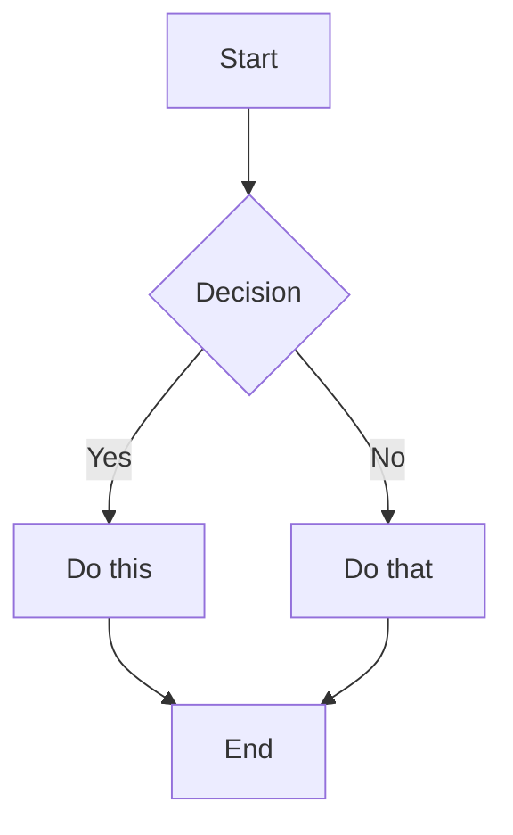
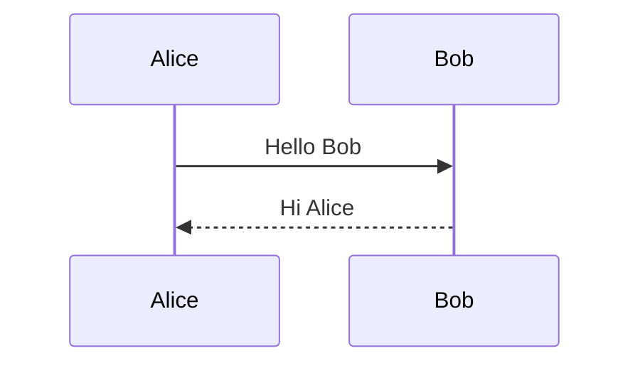
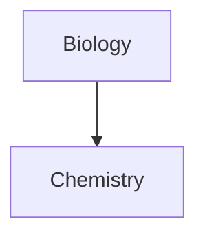

# Skill Obsidian Flavored Markdown

Questa skill abilita agenti skills-compatibili a creare ed editare Markdown Flavored Obsidian valido, incluse tutte le estensioni sintassi specifiche di Obsidian.

## Panoramica

Obsidian usa una combinazione di flavor Markdown:

- [CommonMark](https://commonmark.org/)
- [GitHub Flavored Markdown](https://github.github.com/gfm/)
- [LaTeX](https://www.latex-project.org/) per matematica
- Estensioni specifiche Obsidian (wikilinks, callouts, embeds, ecc.)

## Formattazione Base

### Paragrafi e Interruzioni Riga

```markdown
Questo è un paragrafo.

Questo è un altro paragrafo (riga vuota in mezzo crea paragrafi separati).

Per un'interruzione di riga all'interno di un paragrafo, aggiungi due spazi alla fine  
o usa Shift+Enter.
```

### Intestazioni

```markdown
# Intestazione 1

## Intestazione 2

### Intestazione 3

#### Intestazione 4

##### Intestazione 5

###### Intestazione 6
```

### Formattazione Testo

| Stile               | Sintassi                | Esempio           | Output          |
| ------------------- | ----------------------- | ----------------- | --------------- |
| Grassetto           | `**text**` o `__text__` | `**Bold**`        | **Bold**        |
| Corsivo             | `*text*` o `_text_`     | `*Italic*`        | _Italic_        |
| Grassetto + Corsivo | `***text***`            | `***Both***`      | **_Both_**      |
| Barrato             | `~~text~~`              | `~~Striked~~`     | ~~Striked~~     |
| Evidenziato         | `==text==`              | `==Highlighted==` | ==Highlighted== |
| Codice Inline       | `` `code` ``            | `` `code` ``      | `code`          |

### Escaping Formattazione

Usa backslash per escapare caratteri speciali:

```markdown
\*Questo non sarà corsivo\*
\#Questa non sarà un'intestazione
1\. Questo non sarà un elemento lista
```

Caratteri comuni da escapare: `\*`, `\_`, `\#`, `` \` ``, `\|`, `\~`

## Link Interni (Wikilinks)

### Link Base

```markdown
[[Nome Nota]]
[[Nome Nota.md]]
[[Nome Nota|Testo Visualizzato]]
```

### Link a Intestazioni

```markdown
[[Nome Nota#Intestazione]]
[[Nome Nota#Intestazione|Testo Personalizzato]]
[[#Intestazione nella stessa nota]]
[[##Cerca tutte le intestazioni nel vault]]
```

### Link a Blocchi

```markdown
[[Nome Nota#^block-id]]
[[Nome Nota#^block-id|Testo Personalizzato]]
```

Definisci un block ID aggiungendo `^block-id` alla fine di un paragrafo:

```markdown
Questo è un paragrafo che può essere linkato. ^my-block-id
```

Per liste e quote, aggiungi il block ID su una riga separata:

```markdown
> Questa è una citazione
> Con linee multiple

^quote-id
```

### Link Ricerca

```markdown
[[##heading]] Cerca intestazioni contenenti "heading"
[[^^block]] Cerca blocchi contenenti "block"
```

## Link Stile Markdown

```markdown
[Testo Visualizzato](Nome%20Nota.md)
[Testo Visualizzato](Nome%20Nota.md#Intestazione)
[Testo Visualizzato](https://example.com)
[Nota](obsidian://open?vault=VaultName&file=Note.md)
```

Nota: Gli spazi devono essere URL-encoded come `%20` nei link Markdown.

## Embeds

### Incorpora Note

```markdown
![[Nome Nota]]
![[Nome Nota#Intestazione]]
![[Nome Nota#^block-id]]
```

### Incorpora Immagini

```markdown
![[image.png]]
![[image.png|640x480]] Larghezza x Altezza
![[image.png|300]] Solo Larghezza (mantiene aspect ratio)
```

### Immagini Esterne

```markdown


```

### Incorpora Audio

```markdown
![[audio.mp3]]
![[audio.ogg]]
```

### Incorpora PDF

```markdown
![[document.pdf]]
![[document.pdf#page=3]]
![[document.pdf#height=400]]
```

### Incorpora Liste

```markdown
![[Note#^list-id]]
```

Dove la lista è stata definita con un block ID:

```markdown
- Item 1
- Item 2
- Item 3

^list-id
```

### Incorpora Risultati Ricerca

````markdown
```query
tag:#project status:done
```
````

## Callouts

### Callout Base

```markdown
> [!note]
> Questo è un callout nota.

> [!info] Titolo Personalizzato
> Questo callout ha un titolo personalizzato.

> [!tip] Solo Titolo
```

### Callouts Ripiegabili

```markdown
> [!faq]- Collassato di default
> Questo contenuto è nascosto finché espanso.

> [!faq]+ Espanso di default
> Questo contenuto è visibile ma può essere collassato.
```

### Callouts Annidati

```markdown
> [!question] Callout esterno
>
> > [!note] Callout interno
> > Contenuto annidato
```

### Tipi Callout Supportati

| Tipo       | Alias                  | Descrizione                  |
| ---------- | ---------------------- | ---------------------------- |
| `note`     | -                      | Blu, icona matita            |
| `abstract` | `summary`, `tldr`      | Verde acqua, icona clipboard |
| `info`     | -                      | Blu, icona info              |
| `todo`     | -                      | Blu, icona checkbox          |
| `tip`      | `hint`, `important`    | Ciano, icona fiamma          |
| `success`  | `check`, `done`        | Verde, icona spunta          |
| `question` | `help`, `faq`          | Giallo, punto interrogativo  |
| `warning`  | `caution`, `attention` | Arancione, icona avviso      |
| `failure`  | `fail`, `missing`      | Rosso, icona X               |
| `danger`   | `error`                | Rosso, icona fulmine         |
| `bug`      | -                      | Rosso, icona bug             |
| `example`  | -                      | Viola, icona lista           |
| `quote`    | `cite`                 | Grigio, icona citazione      |

### Callouts Personalizzati (CSS)

```css
.callout[data-callout="custom-type"] {
  --callout-color: 255, 0, 0;
  --callout-icon: lucide-alert-circle;
}
```

## Liste

### Liste Non Ordinate

```markdown
- Item 1
- Item 2
  - Item annidato
  - Altro annidato
- Item 3

* Funziona anche con asterischi

- O segni più
```

### Liste Ordinate

```markdown
1. Primo item
2. Secondo item
   1. Numerato annidato
   2. Altro annidato
3. Terzo item

1) Sintassi alternativa
2) Con parentesi
```

### Liste Task

```markdown
- [ ] Task incompleto
- [x] Task completato
- [ ] Task con sub-task
  - [ ] Subtask 1
  - [x] Subtask 2
```

## Citazioni (Quotes)

```markdown
> Questo è un blockquote.
> Può estendersi su più righe.
>
> E includere paragrafi multipli.
>
> > Citazioni annidate funzionano pure.
```

## Codice

### Codice Inline

```markdown
Usa `backticks` per codice inline.
Usa doppi backticks per ``codice con un ` backtick dentro``.
```

### Blocchi Codice

````markdown
```
Blocco codice semplice
```

```javascript
// Blocco codice con syntax highlighting
function hello() {
  console.log("Hello, world!");
}
```

```python
# Esempio Python
def greet(name):
    print(f"Hello, {name}!")
```
````

### Annidare Blocchi Codice

Usa più backtick o tildi per il blocco esterno:

`````markdown
````markdown
Ecco come creare un blocco codice:

```js
console.log("Hello");
```
````
`````

## Tabelle

```markdown
| Intestazione 1 | Intestazione 2 | Intestazione 3 |
| -------------- | -------------- | -------------- |
| Cella 1        | Cella 2        | Cella 3        |
| Cella 4        | Cella 5        | Cella 6        |
```

### Allineamento

```markdown
| Sinistra | Centro | Destra |
| :------- | :----: | -----: |
| Sinistra | Centro | Destra |
```

### Usare Pipe nelle Tabelle

Escapa pipe con backslash:

```markdown
| Colonna 1         | Colonna 2       |
| ----------------- | --------------- |
| [[Link\|Display]] | ![[Image\|100]] |
```

## Matematica (LaTeX)

### Matematica Inline

```markdown
Questa è matematica inline: $e^{i\pi} + 1 = 0$
```

### Matematica Blocco

```markdown
$$
\begin{vmatrix}
a & b \\
c & d
\end{vmatrix} = ad - bc
$$
```

### Sintassi Matematica Comune

```markdown
$x^2$ Apice
$x_i$ Pedice
$\frac{a}{b}$ Frazione
$\sqrt{x}$ Radice quadrata
$\sum_{i=1}^{n}$ Sommatoria
$\int_a^b$ Integrale
$\alpha, \beta$ Lettere greche
```

## Diagrammi (Mermaid)

````markdown

````

### Diagrammi Sequenza

````markdown

````

### Linkare nei Diagrammi

````markdown

````

## Note a Piè di Pagina (Footnotes)

```markdown
Questa frase ha una nota a piè di pagina[^1].

[^1]: Questo è il contenuto della nota.

Puoi anche usare note nominate[^note].

[^note]: Note nominate appaiono comunque come numeri.

Note inline sono anche supportate.^[Questa è una nota inline.]
```

## Commenti

```markdown
Questo è visibile %%ma questo è nascosto%% testo.

%%
Questo intero blocco è nascosto.
Non apparirà nella vista lettura.
%%
```

## Regole Orizzontali

```markdown
---

---

---

---

---
```

## Proprietà (Frontmatter)

Le proprietà usano YAML frontmatter all'inizio di una nota:

```yaml
---
title: Titolo Mia Nota
date: 2024-01-15
tags:
  - project
  - important
aliases:
  - Mia Nota
  - Nome Alternativo
cssclasses:
  - custom-class
status: in-progress
rating: 4.5
completed: false
due: 2024-02-01T14:30:00
---
```

### Tipi Proprietà

| Tipo        | Esempio                         |
| ----------- | ------------------------------- |
| Text        | `title: My Title`               |
| Number      | `rating: 4.5`                   |
| Checkbox    | `completed: true`               |
| Date        | `date: 2024-01-15`              |
| Date & Time | `due: 2024-01-15T14:30:00`      |
| List        | `tags: [one, two]` o lista YAML |
| Links       | `related: "[[Other Note]]"`     |

### Proprietà Default

- `tags` - Tag nota
- `aliases` - Nomi alternativi per la nota
- `cssclasses` - Classi CSS applicate alla nota

## Tag

```markdown
#tag
#nested/tag
#tag-with-dashes
#tag_with_underscores

## In frontmatter:

tags:

- tag1
- nested/tag2

---
```

I tag possono contenere:

- Lettere (qualsiasi lingua)
- Numeri (non come primo carattere)
- Underscore `_`
- Trattini `-`
- Slash `/` (per annidamento)

## Contenuto HTML

Obsidian supporta HTML dentro Markdown:

```markdown
<div class="custom-container">
  <span style="color: red;">Testo colorato</span>
</div>

<details>
  <summary>Clicca per espandere</summary>
  Contenuto nascosto qui.
</details>

<kbd>Ctrl</kbd> + <kbd>C</kbd>
```

## Riferimenti

- [Sintassi formattazione base](https://help.obsidian.md/syntax)
- [Sintassi formattazione avanzata](https://help.obsidian.md/advanced-syntax)
- [Obsidian Flavored Markdown](https://help.obsidian.md/obsidian-flavored-markdown)
- [Link interni](https://help.obsidian.md/links)
- [File incorporati](https://help.obsidian.md/embeds)
- [Callouts](https://help.obsidian.md/callouts)
- [Proprietà](https://help.obsidian.md/properties)
